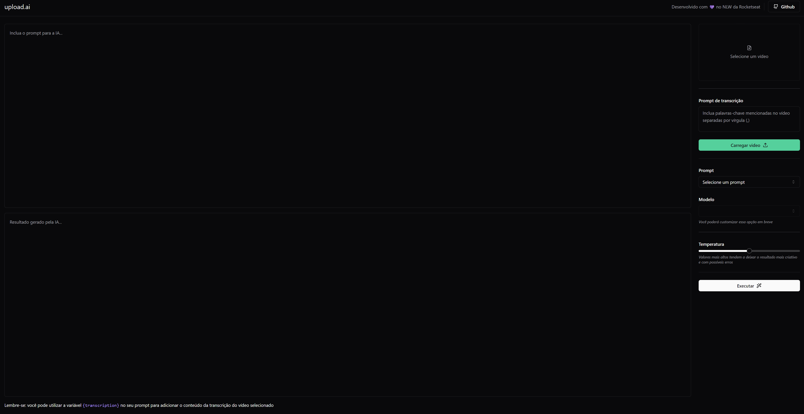

# Upload AI

## A Node application that upload videos and transcript video to generate title and description

The idea behind the project is to upload videos and, based on a prompt, model and temperature, a title and description will be generated by the AI. Changing prompt or temperature will result in different texts.

It's also a part of my personal portfolio, which I use to explore OpenAI APIs to understand better how an AI works and think in some use cases, both for study and to apply in future projects

## Technologies used
**Backend**

* NodeJS
* OpenAi
* Fastify
* Prisma
* Zod

**Frontend**

* React
* OpenAi
* Tailwindcss
* Vite
* FFMPEG

## Visual helper



## Getting Started
### Prerequisites

To run this project, it's necessary to prepare your environment, which means:

1. Install NodeJS 16+ - https://nodejs.org/en
2. Create a account on OpenAI - https://openai.com/

### Installing
**Cloning the Repository**
```
$ git clone https://github.com/ArthurPMachado/Upload-IA.git

$ cd Upload-IA
```
**Installing dependencies**

⚠️ **Given it has both frontend and backend, it's necessary to run the following commands on each folder, either web or api**

```
$ npm i
```

### Running Project

```
$ npm run dev
```

# Author

👤 **Arthur Machado**

- Github: [@Arthur Machado](https://github.com/ArthurPMachado)
- LinkedIn: [@Arthur Machado](https://linkedin.com/in/arthurpmachado)

## Show your support

Give a ⭐️ if this project helped you!
